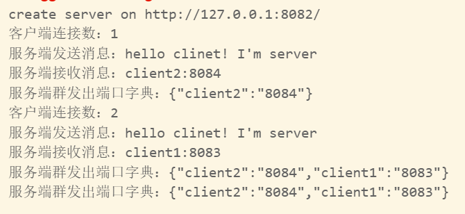
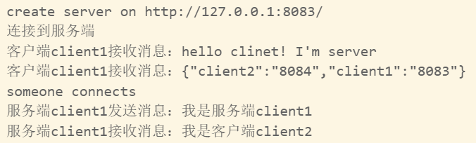
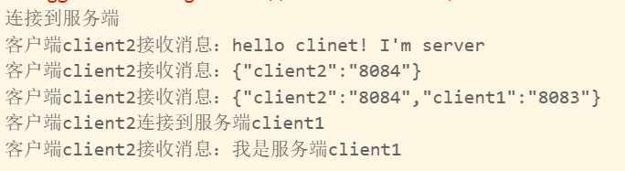
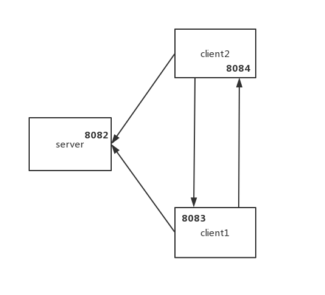

开启服务顺序：server-->client2-->client1

# 效果展示

服务端server：

客户端client1：

客户端client2：

# 执行流程

- 客户端client1和客户端client2通过端口8082和服务端server进行连接，并将它们空闲的端口发给服务端server

- client1还要作为服务端去监听它空闲的端口

- 服务端server将与它相连的客户端都放到一个数组里，把每个客户端空闲的端口都放到一个字典里，并把字典群发给每个客户端（通过遍历数组）

- 接着客户端client1和客户端client2断开与服务端server的连接

- 客户端client2去请求与服务端client1连接，连接后client1与client2可以直接通信