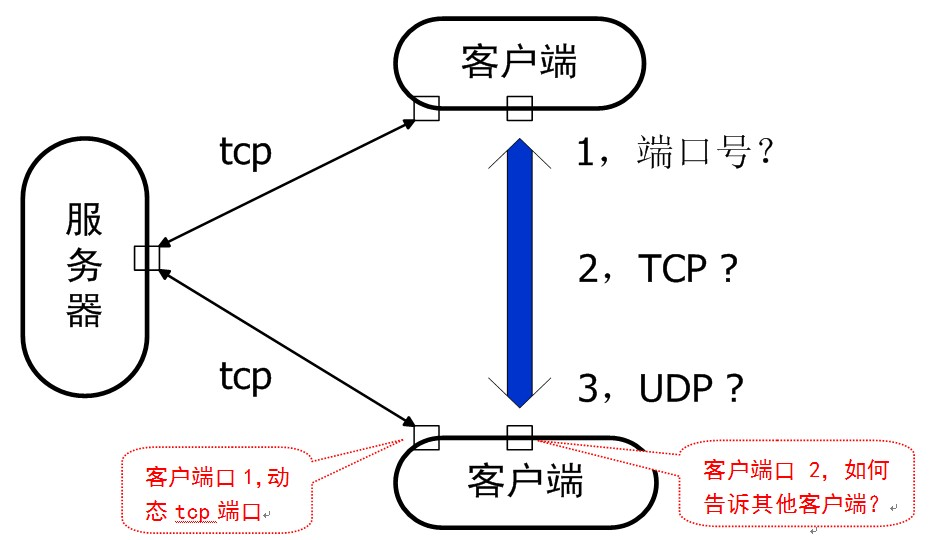

# 实验内容：基于服务器的客户端相互直接通信

具体要求包括：

1.Server支持多客户访问；

2.C与S之间使用TCP连接；

3.C与C之间直接通信（不是通过S传递）。

4.C与C之间直接通信既可以使用TCP，也可以使用UDP。

5.可以使用Socket，也可以使用TcpClient/UdpClient等；

6.实验示意图如下：

# 实验提示

1.交换双方的端口号

- 教材例子登陆时发送了用户名，可以顺便发送端口号,服务器收到后分发给各个客户。

login,UserName,IP:Port

- 每个客户端要预先获得一个“可用”的端口号，才能告诉服务器自己监听的端口号。注意此端口号，与连接服务器时获得的动态端口号，不是同一个端口。

2.客户端之间用TCP通信

- 每个客户端自己也要充当服务器的角色，监听自己的某个端口等待其他客户来连接------启动监听线程；

- 发起会话的一端，可以使用动态端口去连接另一端；

- 假如客户C1直接去连接客户C2（此时C2作为服务端），连接建立后C1可以发消息给C2，消息发送后连接是否要保留？

- 接上，如果保留连接，C2回发消息给C1，如何处理？

- 接上，如果不保留连接，则表示双方每发一次消息，就建立一次连接。

3.客户端之间用UDP通信

每个客户端启动一个收消息的线程即可。问题是，如何知道是谁发过来的消息。

4.编程选择

可以书上例题代码为基础，进行修改；或者继续修改上个实验代码；

客户端c1与c2通过服务器获取相互的端口及用户消息后，关闭服务器可以直接通信。