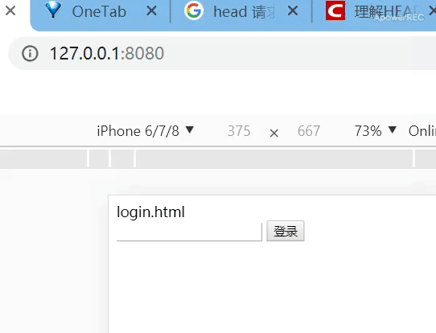

# 项目地址

[http server](https://github.com/michwh/network-programming/tree/master/%E5%AE%9E%E9%AA%8C%E4%BA%94%EF%BC%9AHTTP%E7%BC%96%E7%A8%8B%E5%AE%9E%E9%AA%8C)

# 题目

设计一个模拟HTTP服务端程序

自己设计一个WEB的程序，监听80端口。支持多客户端连接，能满足客户的HTTP请求（浏览器访问），包括以下功能：

1.基本功能：get、post（带数据请求）、head请求

2.模拟登陆访问，页面redirector功能（设计登陆页面login.html、主页index.html，如果直接访问index.html则跳转到登陆页面，只有登陆后才能打开主页）

3.其他（如cookie）

# 效果展示



# 思路

- 用户打开网址 `127.0.0.1:8080` 时，客户端发起 get 请求，请求路径为 `/` ，服务端返回 login.html 页面。

```js
if (request.url === '/') {
  fs.readFile('./login.html', function (err, data) {
    if (!err) {
      response.writeHead(200, { "Content-Type": "text/html;charset=UTF-8" });
      response.end(data)
    } else {
      throw err;
    }
  });
}
```

- 当用户试图通过浏览器地址访问 `/index` 时，服务端会判断请求头是否携带 cookie ，若没有则将请求重定向到 `/` 。

```js
if (!request.headers.cookie) {
  response.writeHead(301, { 'Location': '/' })
  response.end()
}
```

- 如果有携带 cookie ，则将浏览器重定向到 index.html 页面

```js
window.location.href = '/index'
```


- 用户在 login.html 界面输入用户名并点击登录，客户端会携带用户名发起一个 post 请求

```js
let input = {
  name: document.querySelector('.input').value
}
let request = new XMLHttpRequest(); // 新建XMLHttpRequest对象
request.open('POST', '/login', true)
request.send(JSON.stringify(input))
```

- 服务端接收参数，设置 cookie

```js
response.writeHead(200, {
  // cookie只能设置当前域名和父域名，同级域名无效
  'Set-Cookie': `name=${json.name}`,
  'Content-Type': 'text/plain',
})
response.end()
```

- 如果客户端发情 HEAD 请求，只返回相应头

```js
if (request.url === '/getHead') {
  response.writeHead(200);
  response.end()
}
```